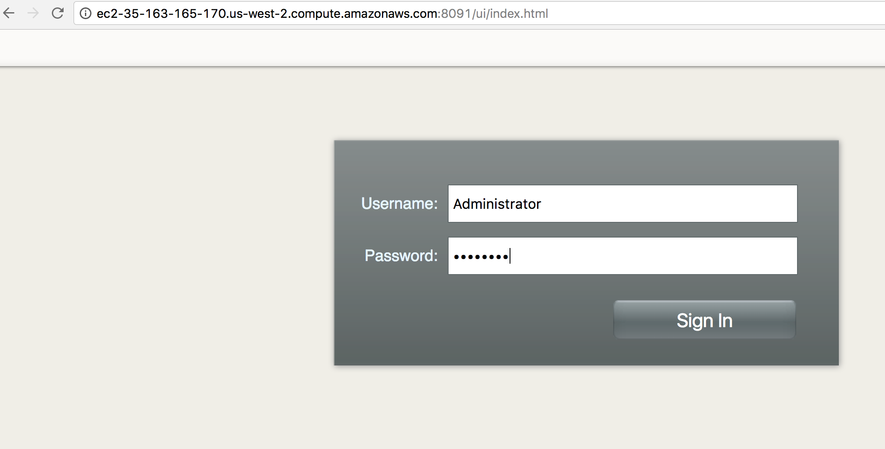
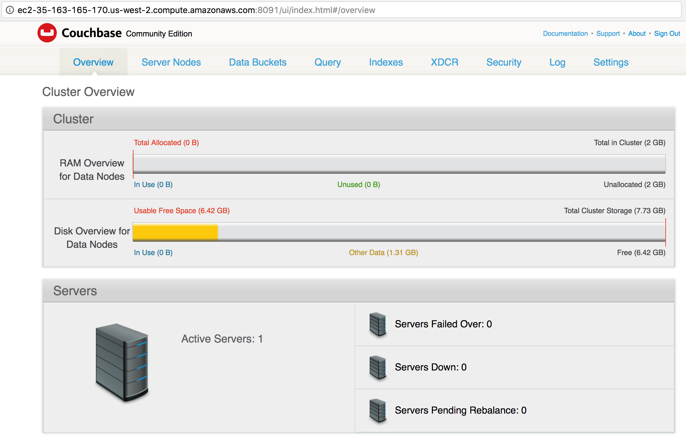

= Run Couchase on Amazon EC2 Using CLI

Several https://aws.amazon.com/marketplace/seller-profile?id=1a064a14-5ac2-4980-9167-15746aabde72[official Couchbase Server AMIs] exist which you allow to easily get started with Couchbase Server on Amazon EC2. This starter guide shows you how to get started with Couchbase Server 4.5 CE on EC2.

We'll use Ubuntu 14.04 LTS for this guide. The AWS CLI and Couchbase Server CLI will be used for configuration.

== AWS CLI

First step is to http://docs.aws.amazon.com/cli/latest/userguide/installing.html[install] the AWS CLI. It needs to be http://docs.aws.amazon.com/cli/latest/userguide/cli-chap-getting-started.html[configured] with your AWS credentials.

== AWS Security Group

By default, all ingress ports on an EC2 instance are blocked. Couchbase Server requires certain ports to be open. This can be achieved by creating a security group and adding the ingress ports to that group. 

. Create a security group:
+
```
aws ec2 create-security-group --group-name CouchbaseSecurityGroup --description "Couchbase Security Group"
```
+
. The following ports need to be included in this security group:
+
[options="header", width="50%"]
|====
| Port | Purpose
| 22 | SSH
| 8091 | REST/HTTP traffic for Couchbase Server Web Console
| 8092 | Views, run queries and XDCR
| 8093 | REST/HTTP port for Query services
| 8094 | REST/HTTP port for Search services
| 11210 | Communication with the Data service
|====
+
These ports are over plain HTTP. For production purposes, it's strongly recommended to open up and use the corresponding SSL ports as well. The complete set of ports is listed in https://developer.couchbase.com/documentation/server/current/install/install-ports.html[Network Configuration].
+
This can be done by invoking the following command:
+
```
aws ec2 authorize-security-group-ingress --group-name CouchbaseSecurityGroup --protocol tcp --port 22 --cidr 0.0.0.0/0
aws ec2 authorize-security-group-ingress --group-name CouchbaseSecurityGroup --protocol tcp --port 8091 --cidr 0.0.0.0/0
aws ec2 authorize-security-group-ingress --group-name CouchbaseSecurityGroup --protocol tcp --port 8092 --cidr 0.0.0.0/0
aws ec2 authorize-security-group-ingress --group-name CouchbaseSecurityGroup --protocol tcp --port 8093 --cidr 0.0.0.0/0
aws ec2 authorize-security-group-ingress --group-name CouchbaseSecurityGroup --protocol tcp --port 8094 --cidr 0.0.0.0/0
aws ec2 authorize-security-group-ingress --group-name CouchbaseSecurityGroup --protocol tcp --port 11210 --cidr 0.0.0.0/0
```

== Launch EC2 Instance

. The complete list of supported platforms for Couchbase Server is listed in the https://developer.couchbase.com/documentation/server/4.5/install/install-platforms.html[Couchbase Server documentation]. Launch an Ubuntu instance:
+
```
aws ec2 run-instances --image-id ami-cee95aae --count 1 --instance-type m3.large --key-name arun-cb-west2 --security-groups "CouchbaseSecurityGroup"
```
+
.. `--image-id` is the AMI ID is for 14.04 LTS with HVM EBS-SSD. This AMI will only work in the `us-west-2` zone. The complete list of AMIs for your zone can be found at https://cloud-images.ubuntu.com/locator/ec2/.
.. One instance of Couchbase server is started, as specified by `--count` option
.. The `m3.large` instance has 2 vCPUs and 7.5 GB RAM. https://developer.couchbase.com/documentation/server/current/install/pre-install.html[Couchbase Hardware Requirements] define the minimum and recommended hardware requirements.
.. Security key pair can be created as explained in http://docs.aws.amazon.com/cli/latest/reference/ec2/create-key-pair.html[create-key-pair]. It is used with `--key-name` option.
.. Previously created security group is specified with `--security-groups` option.
+
. Find public IP address of the EC2 instance:
+
```
aws ec2 describe-instances --query 'Reservations[*].Instances[*].[PublicDnsName]' --filters Name=instance-state-name,Values=running --output text
```

== Download and Install Couchbase Server

. Login to the EC2 instance: `ssh -i <key> -o StrictHostKeyChecking=no ubuntu@<public-ip>`. A sample command would look like:
+
```
ssh -i ~/.ssh/arun-cb-west2.pem -o StrictHostKeyChecking=no ubuntu@ec2-35-163-165-170.us-west-2.compute.amazonaws.com
```
+
. Download latest Couchbase Server CE: `wget http://packages.couchbase.com/releases/4.5.0/couchbase-server-community_4.5.0-ubuntu14.04_amd64.deb`
+
This starter kit is using Couchbase Server CE as convenience. It's strongly recommended that you download Couchbase Server EE instead from https://www.couchbase.com/downloads - see the differences between the editions at https://developer.couchbase.com/documentation/server/4.5/introduction/editions.html. Running Couchbase Server EE requires that you complete a simple registration form.
+
. Install Couchbase: `sudo dpkg -i couchbase-server-community_4.5.0-ubuntu14.04_amd64.deb`

== Configure Couchbase Server

Configure Couchbase Server using https://developer.couchbase.com/documentation/server/current/cli/cbcli-intro.html[Couchbase CLI]:

```
/opt/couchbase/bin/couchbase-cli \
    cluster-init \
    -c ec2-35-163-165-170.us-west-2.compute.amazonaws.com:8091 \
    -u Administrator \
    -p password \
    --cluster-ramsize=2048 \
    --cluster-index-ramsize=2048 \
    --services=data,index,query,fts
```

Make sure to replace the public IP address with your own.

This will show a message like:

```
SUCCESS: init/edit ec2-35-163-165-170.us-west-2.compute.amazonaws.com
```

In this command:

. `cluster-init` sets the user name, password, port, RAM size and services for a cluster
. `-u` is admin user name of the cluster
. `-p` is admin password of the cluster
. `--cluster-ramsize` defines the per node RAM quota for the Data service
. `--cluster-index-ramsize` defines the per node RAM quota for the Index service
. `--services` defines the services that runs on the first node of this cluster

== Access Couchbase Server

Couchbase Server is now accessible at http://<public-ip>:8091. The web console looks like:



Enter the user name `Administrator` and password as `password`. This was configured in our command previously.

By default, the Couchbase Server web console looks like:



There is only one active server. RAM and Disk overview of Data nodes is shown.

Clicking on the `Server` tab shows more details about the node:

image::images/couchbase-amazon-cli-web-console-server.png[]

Data, Full Text, Index and Query services are enabled for the node.

Enjoy!

