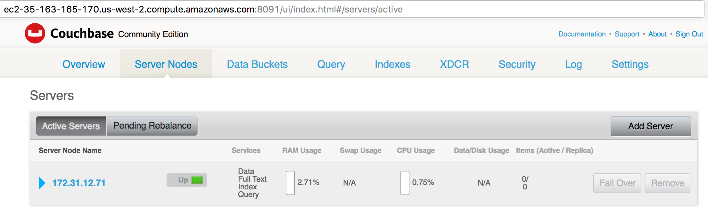

= Run Couchase on Amazon EC2 Using CLI

https://aws.amazon.com/marketplace/seller-profile?id=1a064a14-5ac2-4980-9167-15746aabde72[Several Couchbase AMIs] allow to easily get started with Couchbase on Amazon EC2. This starter guide shows how to get started with Couchbase Server 4.5 CE on EC2.

We'll use Ubuntu 14.04 LTS for this guide. AWS CLI and Couchbase CLI will be used for configuration.

== AWS CLI

First step is to http://docs.aws.amazon.com/cli/latest/userguide/installing.html[install] the AWS CLI. It needs to be http://docs.aws.amazon.com/cli/latest/userguide/cli-chap-getting-started.html[configured] with your AWS credentials.

== AWS Security Group

By default, all ingress ports on an EC2 instance are blocked. Couchbase requires certain ports to be open. This can be achieved by creating a security group and adding the ingress ports to that group. 

. Create a security group:
+
```
aws ec2 create-security-group --group-name CouchbaseSecurityGroup --description "Couchbase Security Group"
```
+
. The following ports need to be included in this security group:
+
[options="header", width="50%"]
|====
| Port | Purpose
| 22 | SSH
| 8091 | REST/HTTP traffic for Couchbase Web Console
| 8092 | Views, run queries and XDCR
| 8093 | REST/HTTP port for Query services
| 8094 | REST/HTTP port for Search services
| 11210 | SDKs and memcached
|====
+
Complete set of ports is listed at https://developer.couchbase.com/documentation/server/current/install/install-ports.html[Network Configuration].
+
This can be done by invoking the following command:
+
```
aws ec2 authorize-security-group-ingress --group-name CouchbaseSecurityGroup --protocol tcp --port 22 --cidr 0.0.0.0/0
aws ec2 authorize-security-group-ingress --group-name CouchbaseSecurityGroup --protocol tcp --port 8091 --cidr 0.0.0.0/0
aws ec2 authorize-security-group-ingress --group-name CouchbaseSecurityGroup --protocol tcp --port 8092 --cidr 0.0.0.0/0
aws ec2 authorize-security-group-ingress --group-name CouchbaseSecurityGroup --protocol tcp --port 8093 --cidr 0.0.0.0/0
aws ec2 authorize-security-group-ingress --group-name CouchbaseSecurityGroup --protocol tcp --port 8094 --cidr 0.0.0.0/0
aws ec2 authorize-security-group-ingress --group-name CouchbaseSecurityGroup --protocol tcp --port 11210 --cidr 0.0.0.0/0
```

== Launch EC2 Instance

. Complete list of supported platforms for Couchbase is listed at http://coucbase.com/downloads[coucbase.com/downloads]. Launch an Ubuntu instance:
+
```
aws ec2 run-instances --image-id ami-cee95aae --count 1 --instance-type m3.xlarge --key-name arun-cb-west2 --security-groups "CouchbaseSecurityGroup"
```
+
.. `--image-id` is the AMI ID is for 14.04 LTS with HVM EBS-SSD. This AMI will only work in `us-west-2` zone. Complete list of AMI ID for your zone at https://cloud-images.ubuntu.com/locator/ec2/.
.. One instance of Couchbase server is started as specified by `--count` option
.. `m3.xlarge` is 4 vCPUs and 15 GB RAM.
.. Security key pair can be created as explained in http://docs.aws.amazon.com/cli/latest/reference/ec2/create-key-pair.html[create-key-pair]. It is used with `--key-name` option.
.. Previously created security group is specified with `--security-groups` option.
+
. Find public IP address of the EC2 instance:
+
```
aws ec2 describe-instances --query 'Reservations[*].Instances[*].[PublicDnsName]' --filters Name=instance-state-name,Values=running --output text
```

== Download and Install Couchbase

. Login to the EC2 instance: `ssh -i <key> -o StrictHostKeyChecking=no ubuntu@<public-ip>`. A sample command would look like:
+
```
ssh -i ~/.ssh/arun-cb-west2.pem -o StrictHostKeyChecking=no ubuntu@ec2-35-163-165-170.us-west-2.compute.amazonaws.com
```
+
. Download latest Couchbase CE: `wget http://packages.couchbase.com/releases/4.5.0/couchbase-server-community_4.5.0-ubuntu14.04_amd64.deb`
. Install Couchbase: `sudo dpkg -i couchbase-server-community_4.5.0-ubuntu14.04_amd64.deb`

== Configure Couchbase

Configure Couchbase using https://developer.couchbase.com/documentation/server/current/cli/cbcli-intro.html[Couchbase CLI]:

```
/opt/couchbase/bin/couchbase-cli \
    cluster-init \
    -c ec2-35-163-165-170.us-west-2.compute.amazonaws.com:8091 \
    -u Administrator \
    -p password \
    --cluster-ramsize=2048 \
    --cluster-index-ramsize=2048 \
    --services=data,index,query,fts
```

to see a message like:

```
SUCCESS: init/edit ec2-35-165-171-117.us-west-2.compute.amazonaws.com
```

In this command:

. `cluster-init` sets the user name, password, port, RAM size and services for a cluster
. `-u` is admin user name of the cluster
. `-p` is admin password of the cluster
. `--cluster-ramsize` defines the per node RAM quota for the Data service
. `--cluster-index-ramsize` defines the per node RAM quota for the Index service
. `--services` defines the services that runs on this cluster

== Access Couchbase

Couchbase is now accessible at http://<public-ip>:8091. Web Console looks like:


Enter the user name `Administrator` and password as `password`. This was configured in our commend previously.

Default Couchbase Web Console looks like:


Clicking on the `Server` tab shows more details about the node:



Enjoy!

